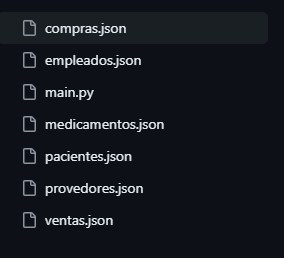

# Ramas en Git 

En este repositorio podrás encontrar un sistema hecho en python con el fin de registrar ventas , registrar compras y almacenar los datos obtenidos  en un json.

El sistema fue hecho para practicar el *manejo de ramas en git* Para practicar lo visto en clase e ir avanzando exitosamente  el curso de Git.

En este trabajo se usaron las ramas: 

* ```master```
* ```desarrollo```

## Información de los comandos usados dn Git

|Comando| Explicación|
|--|--|
|```git add .```| Guardar cambios|
|```git status```| Revisar si los cambios fueron guardados exitosamente|
|```git commit -m":sparkles: ingresar texto"```| Subir el cambio a un repositorio local|
|```git branch ```| Revisar en que rama estoy|
|```git branch desarrollo ```| Crear una rama nueva. En este trabajo la rama creada tiene el nombre de desarrollo|
|```git checkout ``` | Cambiar de rama. En este comando se cambió a la rama master|
|```git merge desarrollo```| Pasar los cambios que se hicieron en la rama desarrollo a la master. Para poder hacer esto hay que estar en la rama master|
|```git branch -D desarrollo```| Borrar la rama. En este comando se eliminó la rama desarrollo|

## Información del sistema Python

Este trabajo cumple con las siguientes características dadas por el cliente : 

*Registro de venta :*

* Ingresar fecha de venta
* Ingresar nombre del cliente
* Ingresar dirección del cliente
* Ingresar el número telefónico del cliente
* Ingresar nombre del empleado
* Ingresar cargo del empleado 
* Ingresar contacto del empleado 
* Ingresar el nombre del producto vendido 
* Ingresar la cantidad del producto vendido 
* Ingresar el precio que pagó el cliente por el producto 

*Registro de Compra*

* Ingresar fecha de compra
* Ingresar nombre del proveedor
* Ingresar contacto del proveedor 
* Ingresar el nombre del producto comprado 
* Ingresar la cantidad del producto comprado

* Lista de empleados
* Lista de pacientes
* Lista de los medicamentos

## Instalación 
1. Clona el repositorio: Utiliza el comando "git clone" seguido de la URL del repositorio para clonar el proyecto en tu computadora local.

2. Abre la carpeta del proyecto: Navega a la carpeta donde se clonó el proyecto y ábrela en tu editor de código favorito.

3. Abre el archivo Python: Busca el archivo principal (usualmente "main.py") y ejecútalo en la terminal.

## Estructura del proyecto

